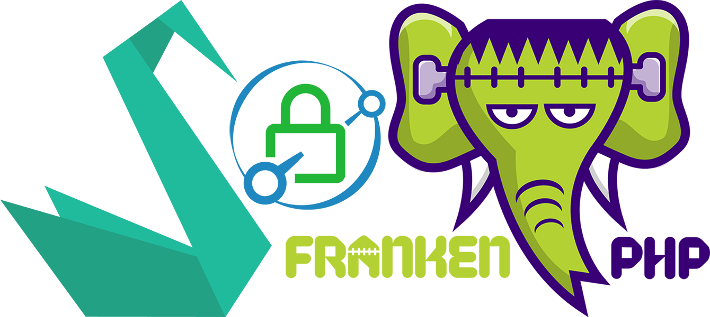

<p align="center">
    
</p>

<h1 align="center">Sylius FrankenPHP Edition by RoyalPHP</h1>

<h6 align="center">This edition is based on the Sylius Standard Edition.</h6>

## About

A [Docker](https://docker.com)-based installer and runtime for the [Sylius](http://sylius.com) eCommerce with [FrankenPHP](https://frankenphp.dev) and [Caddy](https://caddyserver.com) inside!


## Getting Started

All control is via `Makefile`, to see all available commands, run `make`.
For a quick start, execute the following command:

```shell
make setup
```

Under the hood, this command executes several other commands, 
creates the necessary images, fills the database with samples data, and build assets for the client side, 
all this is necessary for the first launch of the project, and in the future you will only `make up` or `make down` your project. 
After successful execution of this command, you can open it in the browser at the standard url: https://localhost/

By default, you're working in a development environment, so for most commands, the `PROJECT_MODE=dev` option is also executed.
However, if you want to deploy your project to a production server, you need to explicitly specify this when executing commands 
(as well as specify the necessary environment variables for your sensitive data), 
for example, to quickly deploy in a production environment, execute the following command:

```shell
make setup PROJECT_MODE=prod
```

## Documentation

Documentation for "Symfony Docker" is available in the [*docs/symfony-docker*](docs/symfony-docker/index.md) folder.

Documentation for "FrankenPHP" is available at [frankenphp.dev/docs](https://frankenphp.dev/docs).

Documentation for "Sylius" is available at [docs.sylius.com](http://docs.sylius.com).

## Bug Tracking

If you want to report a bug or suggest an idea, please use [GitHub issues](https://github.com/royalphp/frankenphp-sylius/issues).

## License

This theme uses [MIT License](LICENSE.md).

## Authors

The theme was originally created by [RoyalPHP](https://github.com/royalphp).
See the list of [contributors](https://github.com/royalphp/frankenphp-sylius/contributors).
